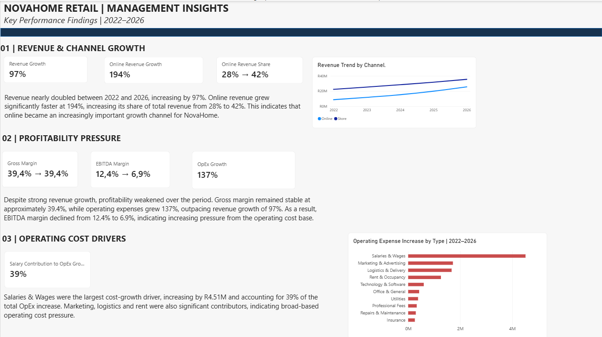

# NovaHome Retail | Financial Performance Analysis

## Project Overview

NovaHome Retail (Pty) Ltd is a simulated omnichannel homeware and lifestyle retailer.

The purpose of this project was to analyse NovaHome's financial performance from 2022 to 2026 and assess how the business performed in terms of revenue growth, profitability and operating costs.

The analysis also explores the key drivers of performance across sales channels, product categories, regions and operating expenses. An interactive Power BI dashboard was developed to communicate the findings and support management decision-making.

> **Note:** This project uses simulated data and was created for portfolio and learning purposes.

## Business Questions

The analysis aimed to answer the following questions:

- How has NovaHome's revenue changed between 2022 and 2026?
- Which sales channels are driving revenue growth?
- Which product categories and regions contribute most to revenue?
- Is revenue growth translating into stronger profitability?
- How have operating expenses changed relative to revenue?
- Which operating expenses are the main drivers of cost growth?
- How have Gross Margin and EBITDA Margin changed over the period?

## Tools & Skills

- **Microsoft Excel** — Initial data exploration, PivotTables, financial analysis and validation
- **Power BI** — Data modelling, interactive dashboard development and visualisation
- **DAX** — Financial measures and KPI calculations
- **Financial Analysis** — Revenue growth, profitability, margin and operating expense analysis
- **Data Visualisation** — Management-focused financial reporting and dashboard design# NovaHome-Financial-Performance-Analysis
Financial performance analysis and Power BI dashboard for a simulated retail company, covering revenue growth, profitability and operating cost drivers from 2022–2026.
## Analysis Approach

The project followed a structured financial analysis process:

1. **Data Understanding & Validation**  
   Reviewed the structure and level of detail of the sales, expense and income statement data before beginning the analysis.

2. **Excel Analysis**  
   Used PivotTables and calculations to analyse revenue, gross profit, operating expenses, EBITDA and net profit across the 2022–2026 period. Results were also analysed by sales channel, product category and region.

3. **Performance & Driver Analysis**  
   Compared revenue and cost growth, analysed profitability margins and investigated the factors contributing to changes in financial performance.

4. **Power BI Data Modelling**  
   Built a Power BI model connecting the relevant sales, expense and dimension tables to support interactive analysis.

5. **DAX Measures**  
   Created measures for key financial KPIs including Total Revenue, Gross Margin %, EBITDA, EBITDA Margin %, YoY Revenue Growth and Net Profit.

6. **Dashboard Development**  
   Developed an interactive Financial Performance Dashboard to present trends, KPIs and performance drivers, supported by a separate Management Insights page highlighting the most important findings.
## Dashboard

### Financial Performance Overview

The Financial Performance Dashboard provides an interactive overview of NovaHome's revenue, profitability, operating expenses and key performance drivers from 2022 to 2026.

### Management Insights

The Management Insights page summarises the key findings from the analysis, focusing on revenue and channel growth, profitability pressure and the main operating cost drivers.

